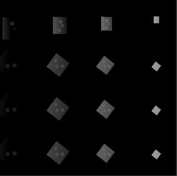

# RayTracing Render

## 1 Inspired by Cat-Like-Coding SRP-Tutorial

[Catlike Coding - Custom SRP Tutorial](https://catlikecoding.com/unity/tutorials/custom-srp/)

SRP implementation of some basic render features,not finish yet.
Current Progress: Cascading Shadows:

## 2 Main Features

**(1) Whole Basic Implementation of SRP**

**(2) Directional Lights and Shadows**

**(3) Shadows' optimization such as Cascades and Bias**

See the engineering notes for details.
